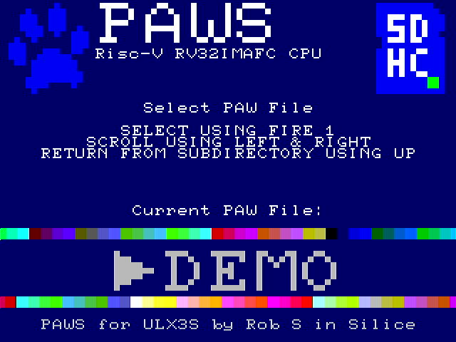
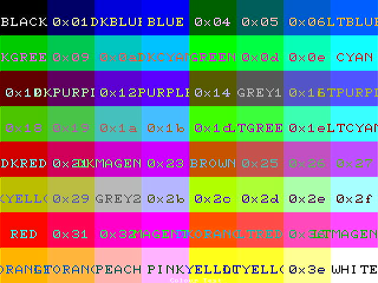
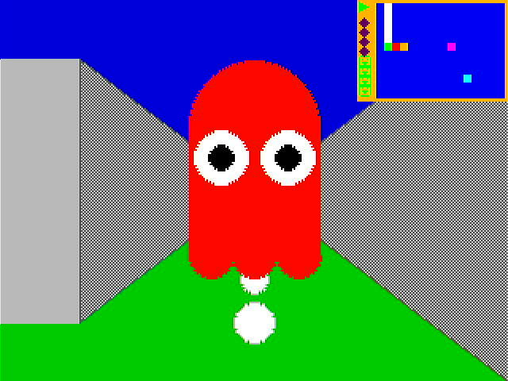
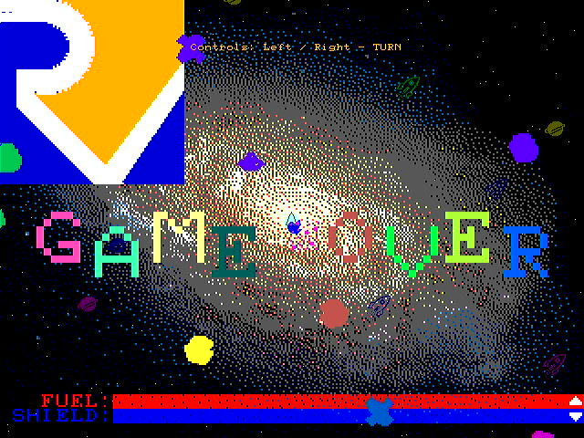
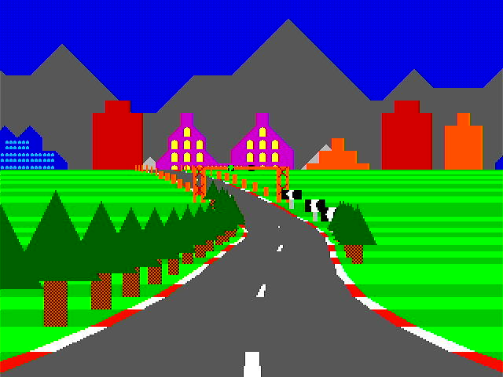

# PAWS a Risc-V RVIMAFC CPU

* Written in Silice
    * Inspired by ICE-V by [ICE-V](https://github.com/sylefeb/Silice/tree/master/projects/ice-v) by @sylefeb

A simple (no interrupts or exceptions/traps), Risc-V RV32IMAFC CPU, with a pseudo SMT (dual thread) capability. The display is similar to the 8-bit era machines, along with audio, SDCARD read support, UART and PS/2 keyboard input.

I set about creating this project as I wanted an easier way to write programs to test my design. I'm old enough that C was my main programming language, so a CPU that had gcc support was the obvious way forward, and Risc-V is a nice elegant design that wasn't too hard for a beginner at FPGA programming to implement.

The display hardware does as much as possible to compensate for the slow CPU speed.

## Quick Instructions

Copy the files from the directory "SOFTWARE/PAWS" to an SDCARD and insert into the ULX3S. Flash the bitstream from "ULX3S/BUILD_ulx3s/PAWS.bit" to the ULX3S

```
fujproj PAWS.bit
```

This will initialise the BIOS and allow the selection of a PAW file to load and run.

## BIOS



* BIOS
    * Initialises the screen and CPU
    * Loads compiled PAW files from the SDCARD to SDRAM and executes
        * FAT32 on SDCARD read via SPI

## Overview

* CPU
    * 25MHz clock
        * Instructions take varying number of clock cycles for execution
            * 4 Pipeline Stages
                * Fetch ( starts partial decode )
                * Decode
                * Execute
                * Dispatch
        * RV32I instruction set
            * AUIPC
            * LUI
            * JAL and JALR
            * BRANCH
            * LOAD
            * STORE
            * INTEGER OPERATION WITH IMMEDIATE PARAMETER
                * ADDI
                * SLTI[U]
                * ANDI ORI XORI
                * SLI SRLI SRAI
            * INTEGER OPERATION WITH REGISTER PARAMETER
                * ADD SUB
                * SLT[U]
                * AND OR XOR
                * SLL SRL SRA
            * CSR ( Limited )
                * READ of TIMER[H], CYCLE[H] and INSTRET[H]
                * Floating-point FCSR register
        * RV32M instruction set
            * HARDWARE MULTIPLICATION AND DIVISION UNITS
                * MUL MULH[[S]U]
                * DIV[U] REM[U]
        * RV32A instruction set
        * RV32F instruction set
        * RV32C instruction expansion
            * COMPRESSED ( 16 bit ) INSTRUCTION SUPPORT
                * Expanded to 32 bit instruction
                * Faster than 32 bit instructions due to less memory fetching

* MEMORY
    * 32K of RAM
        * FAST BRAM - used for BIOS
        * STACK POINTER AT TOP OF BRAM
    * 32K ( 8K x 32 bit ) of I/O Registers with 16 bit read / write
    * 32MB of SDRAM
        * 16K Instruction and Data Cache

* DISPLAY
    * HDMI 640 x 480 ouput
        * Background with pattern generator
            * Co-Processor to switch pattern generator parameters mid-frame
        * 2 x Tilemap Layers
            * 42 x 32 ( 40 x 30 visible ) with pixel scrolling
        * 2 x Sprite Layers
            * 16 sprites per layer
        * Bitmap with GPU
            * Accelerated drawing of lines, rectangles, circles ( optional fill ), triangles
            * Single and full colour blitters
            * Vector block drawer
        * Character Map
            * 80 x 60 with normal/bold font
        * Terminal
            * 80 x 8


<br>64 Colour Display


<br>Demonstration game for the GPU and the hardware accelerated drawing of 2D Shapes


<br>Demonstration game for the sprites


<br>Demonstration game for the blitter and sprites


<br>Test for the floating point unit and the GPU

* PERIPHERALS
    * UART ( via US1 on the ULX3S )
        * 115200 baud
    * PS/2 keyboard, with joystick emulator
    * LEDS ( 8 on board leds )
    * BUTTONS ( 6 on board buttons )
    * TIMERS ( 1hz and 1khz )
    * STEREO AUDIO
    * SDCARD via SPI
        * FAT32 read only support

