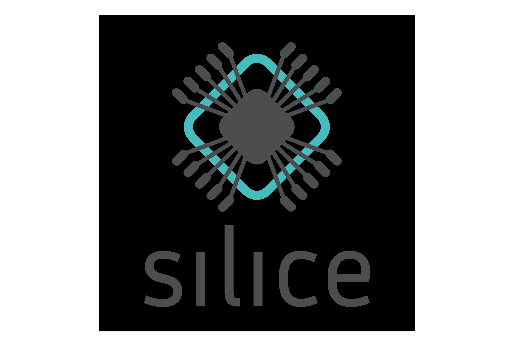

# Silice-Playground
My Silice (https://github.com/sylefeb/Silice) Coding Experimental Area

Examples to play with FOMU, DE10NANO with MiSTer SDRAM, USB HUB and I/O BOARD and ULX3S via Silice.

# FOMU

* FOMU Directory
    * BLINKY
        * Simple LED colour cycle
    * USB_ACM
        * Simple UART input/output test
            * Connect to the UART, type R, G, B or X to change the LED

* j1eforth/FOMU Directory
    * j1eforth
        * The J1 CPU with UART for communication
        * Interactive j1eforth environment

# DE10NANO

* Presently retird, being used for MiSTer!

# ULX3S

* PAWS
    * Risc-V RV32IMAFC CPU with retro console SoC
        * **FAT16** SDCARD Support
            * Copy example programs to the ***ROOT DIRECTORY*** of the **FAT16** partition on the SDCARD
        * GCC support for compiling own programs
            * Requires Risc-V GCC
            * Requires Risc-V NEWLIB
            * Compilation scripts have hardcoded paths for Arch Linux, adjust for your system

* PAWS4th
    * J1 CPU with interactive j1eforth environment and same retro console SoC
        * Programs loaded via UART

* VERILATOR
    * Various test programs
        * Includes the Risc-V floating-point unit tests

