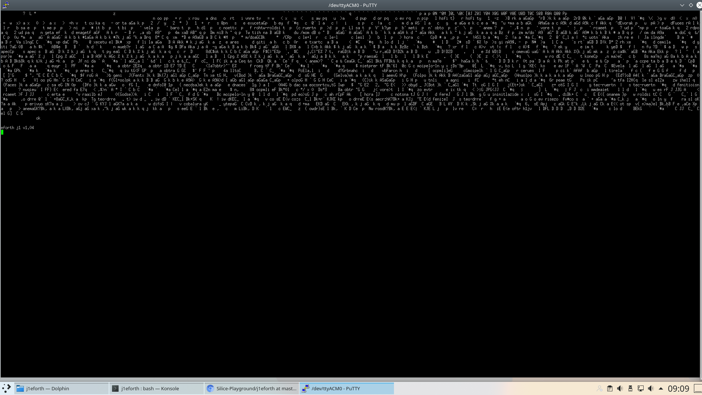

# Silice-Playground
My Silice (https://github.com/sylefeb/Silice) Coding Experimental Area

Examples to play with FOMU via Silice

BLINKY pulses the LED, 
USB_ACM echoes UART input and sets LED according to the input


## j1eforth for FOMU

Translation of the j1eforth interactive Forth environment for FOMU (https://www.crowdsupply.com/sutajio-kosagi/fomu with documentation at  https://workshop.fomu.im/en/latest/).

The original J1 CPU (https://www.excamera.com/sphinx/fpga-j1.html with a very clear explanatory paper at https://www.excamera.com/files/j1.pdf) along with the j1eforth interactive Forth environment (https://github.com/samawati/j1eforth) was written for an FPGA with access to 16384 x 16bit (256kbit) dual port single cycle block ram, whereas the FOMU has 120kbit of block ram. It does however have 1024kbit of single port ram (65536 x 16bit), which is more than sufficient for j1eforth, but it has 2 cycle latency.

j1eforth with the enhanced J1+ CPU for FOMU is coded in Silice (https://github.com/sylefeb/Silice) due to my limited (i.e. NO) FPGA programming experience. Silice provides a nice introduction to FPGA programming for those coming from more tradition software coding. The main challenge for the FOMU is that there is latency to the single port ram, requiring a main loop with cycles to guide memory accesses.

I've, in my opinion, tidied up the code, to make the variables more explanatory, and to aid my coding.

For communicating via a terminal the tinyfpga_bx_usbserial (https://github.com/stef/nb-fomu-hw) was implemented to provide a 115200 baud UART. A 32 character input and output buffer was added.

## Using j1eforth on the FOMU

Download the source code from this repository. Ensure that you have the required toolchain installed. Compile (on Linux) with `./fomu_hacker_USB_SPRAM.sh j1eforth.ice` within the source directory.

Or download the precompiled `j1eforth-FOMU.dfu` file from this repository.

Upload the compiled bitstream to your FOMU with `dfu-util -D build.dfu`, or the downloaded bitstream with `dfu-util -D j1eforth-FOMU.dfu` and connect via your chosen terminal, for minicom `minicom -D /dev/ttyACM0` (ACM0 may need replacing with an appropriate number on your machine).

## Resources on the FOMU

Resource usage has been considerably reduced from my initial attempt at Silice coding, with considerable assistance from @sylefeb who has assisted in using blockrams for the dstack and rstack, and dual ported blockrams for the uart input and output FIFO buffers:

```
Info: Device utilisation:                                                                                                           
Info:            ICESTORM_LC:  2274/ 5280    43%                                                                                    
Info:           ICESTORM_RAM:    20/   30    66%                                                                                    
Info:                  SB_IO:    12/   96    12%                                                                                    
Info:                  SB_GB:     8/    8   100%                                                                                    
Info:           ICESTORM_PLL:     0/    1     0%                                                                                    
Info:            SB_WARMBOOT:     0/    1     0%                                                                                    
Info:           ICESTORM_DSP:     0/    8     0%                                                                                    
Info:         ICESTORM_HFOSC:     0/    1     0%                                                                                    
Info:         ICESTORM_LFOSC:     0/    1     0%                                                                                    
Info:                 SB_I2C:     0/    2     0%                                                                                    
Info:                 SB_SPI:     0/    2     0%                                                                                    
Info:                 IO_I3C:     0/    2     0%                                                                                    
Info:            SB_LEDDA_IP:     0/    1     0%                                                                                    
Info:            SB_RGBA_DRV:     1/    1   100%                                                                                    
Info:         ICESTORM_SPRAM:     4/    4   100%                                                                                    ```
```

The original J1 CPU has this instruction encoding:

```
+---------------------------------------------------------------+
| F | E | D | C | B | A | 9 | 8 | 7 | 6 | 5 | 4 | 3 | 2 | 1 | 0 |
+---------------------------------------------------------------+
| 1 |                    LITERAL VALUE                          |
+---------------------------------------------------------------+
| 0 | 0 | 0 |            BRANCH TARGET ADDRESS                  |
+---------------------------------------------------------------+
| 0 | 0 | 1 |            CONDITIONAL BRANCH TARGET ADDRESS      |
+---------------------------------------------------------------+
| 0 | 1 | 0 |            CALL TARGET ADDRESS                    |
+---------------------------------------------------------------+
| 0 | 1 | 1 |R2P| ALU OPERATION |T2N|T2R|N2A|   | RSTACK| DSTACK|
+---------------------------------------------------------------+
| F | E | D | C | B | A | 9 | 8 | 7 | 6 | 5 | 4 | 3 | 2 | 1 | 0 |
+---------------------------------------------------------------+

T   : Top of data stack
N   : Next on data stack
PC  : Program Counter
 
LITERAL VALUES : push a value onto the data stack
CONDITIONAL    : BRANCHS pop and test the T
CALLS          : PC+1 onto the return stack

T2N : Move T to N
T2R : Move T to top of return stack
N2A : STORE T to memory location addressed by N
R2P : Move top of return stack to PC

RSTACK and DSTACK are signed values (twos compliment) that are
the stack delta (the amount to increment or decrement the stack
by for their respective stacks: return and data)
```

The J1+ CPU adds up to 16 new alu operations, by assigning new alu operations by using ALU bit 4 to determine if J1 or J1+ alu operations.

Binary ALU Operation Code | J1 CPU | J1+ CPU | J1 CPU Forth Word (notes) | J1+ CPU Forth Word | J1+ Implemented in j1eforth
:----: | :----: | :----: | :----: | :----: | :----:
0000 | T | T==0 | (top of stack) | 0= | X
0001 | N | T<>0 | (next on stack) | 0<> | X
0010 | T+N | N<>T | + | <> | X
0011 | T&N | T+1 | and | 1+ | X
0100 | T&#124;N | | or | | 
0101 | T^N | | xor | | 
0110 | ~T | | invert | | 
0111 | N==T | | = | | 
1000 | N<T | | < (signed) | | 
1001 | N>>T | | rshift | | 
1010 | T-1 | | 1- | | 
1011 |  rt | | (push top of return stack to data stack) | | 
1100 | [T] | | @ (read from memory) | | 
1101 | N<<T | | lshift | | 
1110 | dsp | | (depth of stacks) | | 
1111 | NU<T | | < (unsigned) | | 

*I am presently unable to add any further J1+ CPU alu operations to the j1eforth code, as the compiled ROM is no longer functional. Some assistance to add further instructions would be appreciated. I was thinking of - > u> negate abs max min 2&#42; 2/ as these will be simple to add to the J1+ ALUOP case block.*

### Memory Map

Hexadecimal Address | Usage
:----: | :----:
0000 - 3fff | Program code and data
4000 - 7fff | RAM (written to with `value addr !`, read by `addr @`
f000 | UART input/output (best to leave to j1eforth to operate via IN/OUT buffers)
f001 | UART Status (bit 1 = TX buffer full, bit 0 = RX character available, best to leave to j1eforth to operate via IN/OUT buffers)
f002 | RGB LED input/output bitfield { 13b0, red, green, blue }
f003 | BUTTONS input bitfield { 12b0, button 4, button 3, button 2, button 1 }

### Pipeline / CYCLE logic

Due to blockram and SPRAM latency, there needs to be a pipeline for the J1+ CPU on the FOMU, which is set to 16 stages. These are used as follows:

CYCLE | Action
:-----: | :-----:
ALL <br> (at entry to INIT==3 loop) | Check for input from the UART, put into buffer. <br> Check if output in the UART buffer and send to UART. <br> __NOTE:__ To stop a race condition, uartOutBufferTop = newuartOutBufferTop is updated after output.
0 | blockram: Read data stackNext and rstackTop, started in CYCLE==13. <br> <br> SPRAM: Start the read of memory position [stackTop] by setting the SPRAM sram_address and sram_readwrite flag. This is done speculatively in case the ALU needs this memory later in the pipeline.
4 | Complete read of memory position [stackTop] from SPRAM by reading sram_data_read.
5 | Start read of the instruction at memory position [pc] by setting sram_address and sram_readwrite flag.
9 | Complete read of the instruction at memory position [pc] by reading sram_data_read. <br> <br> The instruction is decoded automatically by the continuos assigns := block at the top of the code.
10 | Instruction Execution <br> <br> Determine if LITERAL, BRANCH, BRANCH, CALL or ALU. <br> <br> In the ALU (J1 CPU block) the UART input buffer, UART status register or memory is selected as appropriate. The UART buffers and the speculative memory read of [stackTop] are used to allow __ALL__ ALU operations to execute in one cycle.<br> <br> At the end of the ALU if a write to memory is required, this is initiated by setting the sram_address, sram_data_write and sram_readwrite flag. This will be completed by CYCLE==15. <br> <br> Output to UART output buffer or the RGB LED is performed here if a write to an I/O address, not memory, is requested.
11 | Start the writing to the block ram for the data and return stacks. This will be completed by CYCLE==12.
13 | Update all of the J1+ CPU pointers for the data and return stacks, the program counter, and stackTop. <br> <br> Start the reading of the data and return stacks. This will be completed by CYCLE==14, but not actually read until the return to CYCLE==0.
15 | Reset the sram_readwrite flag, to complete any memory write started in CYCLE==11.
ALL <br> (at end of INIT==3 loop) | Reset the UART output if any character was transmitted. <br> <br> Move to the next CYCLE.

### Forth Words to try
* `cold` reset
* `words` list known Forth words
* `cr` output a carriage return
* `2a emit` output a * (character 2a (hex) 42 (decimal)
* `decimal` use decimal notation
* `hex` use hexadecimal notation


