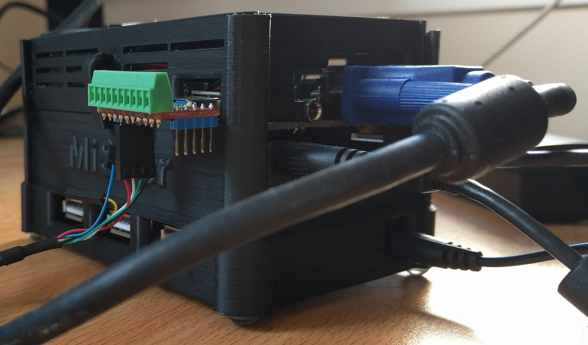

# j1eforth

## DE10NANO and ULX3S Enhancements

* Display
* - VGA for the DE10NANO
* - HDMI for the ULX3S
* PS/2 Keyboard
* - ULX3S has keyboard input (not yet implemented)
* - PS/2 takes priority over the UART
* J1+ CPU
* - 50MHz operation
* - 5 clock cycles per operation against 13 clock cycles per operation on the FOMU, giving an effective CPU running at 10MHz

For communication with j1eforth there is a UART which provides input and output, output is duplicated on the terminal display. The ULX3S will also have PS/2 keyboard input via the us2 connector and a USB OTG and PS/2 to USB converter.

__DE10NANO__ Open a terminal in the DE10NANO directory and type ```make de10nano```. Wait. Upload your design your DE10NNANO with ```quartus_pgm -m jtag -o "p;BUILD_de10nano/build.sof@2"```. Or download from this repository.

__ULX3S__ Open a terminal in the ULX3S directory and type ```make ulx3s```. Wait. Upload your design your ULX3S with ```fujproj BUILD_ulx3s/build.bit```. Or download from this repository.

### Resource Usage (de10nano)

__*Not necessarily the most recent build, used for indicative purporses and monitoring during coding*__

```
Top-level Entity Name : top
Family : Cyclone V
Device : 5CSEBA6U23I7
Timing Models : Final
Logic utilization (in ALMs) : 4,877 / 41,910 ( 12 % )
Total registers : 2840
Total pins : 36 / 314 ( 11 % )
Total virtual pins : 0
Total block memory bits : 2,665,184 / 5,662,720 ( 47 % )
Total RAM Blocks : 352 / 553 ( 64 % )
Total DSP Blocks : 1 / 112 ( < 1 % )
Total HSSI RX PCSs : 0
Total HSSI PMA RX Deserializers : 0
Total HSSI TX PCSs : 0
Total HSSI PMA TX Serializers : 0
Total PLLs : 1 / 6 ( 17 % )
Total DLLs : 0 / 4 ( 0 % )
```

### Resource Usage (ulx3s)

__*Not necessarily the most recent build, used for indicative purporses and monitoring during coding*__

```
Info: Device utilisation:
Info:          TRELLIS_SLICE: 16975/41820    40%
Info:             TRELLIS_IO:    34/  365     9%
Info:                   DCCA:     4/   56     7%
Info:                 DP16KD:   180/  208    86%
Info:             MULT18X18D:     6/  156     3%
Info:                 ALU54B:     0/   78     0%
Info:                EHXPLLL:     2/    4    50%
Info:                EXTREFB:     0/    2     0%
Info:                   DCUA:     0/    2     0%
Info:              PCSCLKDIV:     0/    2     0%
Info:                IOLOGIC:     0/  224     0%
Info:               SIOLOGIC:     8/  141     5%
Info:                    GSR:     0/    1     0%
Info:                  JTAGG:     0/    1     0%
Info:                   OSCG:     0/    1     0%
Info:                  SEDGA:     0/    1     0%
Info:                    DTR:     0/    1     0%
Info:                USRMCLK:     0/    1     0%
Info:                CLKDIVF:     0/    4     0%
Info:              ECLKSYNCB:     0/   10     0%
Info:                DLLDELD:     0/    8     0%
Info:                 DDRDLL:     0/    4     0%
Info:                DQSBUFM:     0/   14     0%
Info:        TRELLIS_ECLKBUF:     0/    8     0%
Info:           ECLKBRIDGECS:     0/    2     0%
```

## VGA/HDMI Multiplexed Display

The VGA DE10NANO/HDMI ULX3S output has the following layers in order:

* Background
* Lower Sprite Layer
* Bitmap with GPU
    * Vector block drawer
    * Display list drawer
* Upper Sprite Layer
* Character Map with TPU
* Terminal

Due to the address space limitations of the J1+ CPU the display layer memories cannot be memory mapped. Control of the display layers is done via memory mapped control registers. _Some_ j1eforth words are provided as helpers.

The initial basic bitmap and terminal windows were extended to include as many capabilities as could fit into the design, which at present is limited by the amount of BRAM available on the ULX3S. The aim being to create a functional general computer running j1eforth, focussing on as many features as possible found in the popular home computers of the 1980s.

For note I owned, and programmed (home computers):

* Game consoles:
    * Atari VCs 2600
    * PlayStation 2
    * PlayStation 3
* Home computers
    * Commodore Vic 20
        * 6502 assembly language
    * Commodore 64
        * 6502 assembly language
        * The motivation for providing sprite layers
    * Atari ST original 512 and 512FM
        * 68000 assembly language
    * Commodore Amiga A500 and A1200
        * 68000 / 68030 assembly language and C

All of the non-CPU components are provided as co-processors, so that the J1+ CPU can continue executing Forth code whilst the co-processor continues with the assigned task. The terminal window for example operates as a basic display output alongside the UART, with no further intervention required by the j1eforth environment to output to the terminal, other than to output to the UART.

The sample code provided in Big Example.md is used for driving feature development, features are added if they are required by the simple asteroids type game. 

### Colour hex numbers

Colour<br>Guide<br>__HEX__ | Colour
:-----: | :-----:
40 | Transparent<br>(where used, bitmap layer, character map layer)
00 | Black
03 | Blue
0c | Green
0f | Cyan
30 | Red
33 | Magenta
3c | Yellow
3f | White

### Background Layer

The initial concept was to provide a solid colour backdrop to the display if all layers above are transparent, i.e. have nothing to display. This was extended to include the limited texture checkerboards, and once the random number generator was included in the j1eforth design, the static generator. The starfield/snow generator from @sylefeb was included to provide a backdrop for the "Big Example", a simple asteroids type game.

* Background with configurable designs
    * single { rrggbb } colour
    * alternative { rrggbb } colour for some designs
        * selectable solid
        * checkerboard
            * in main and alternative colours
        * fixed colour rainbow
        * black/grey/white rolling static
        * starfield/snow
            * with main colour stars/snow and alternative colour background

#### Memory Map for the BACKGROUND Layer

Hexadecimal<br>Address | Write | Read
:----: | ---- | -----
fff0 | Set the background colour |
fff1 | Set the alternative background colour |
fff2 | Set the background design<br>0 - Solid<br>1 - Small checkerboard<br>2 - Medium checkerboard<br>3 - Large checkerboard<br>4 - Huge checkerboard<br>5 - Rainbow<br>6 - Rolling static<br>7 - Starfield/Snow |

#### j1eforth BACKGROUND words

DISPLAY<br>Word | Usage
----- | -----
vblank? | Example ```vblank``` wait for vblank

BACKGROUND<br>Word | Usage
----- | -----
background! | Example: ```3 2 4 background!``` Sets the background to a HUGE blue/dark blue checkerboard

### Bitmap Layer with GPU

* 640 x 480 64 colour { Arrggbb } bitmap display
    * If A (ALPHA) is 1, then the lower layers are displayed
    * Includes a simple GPU to:
        * Draw pixels
        * Lines (via Bresenham's Line Drawing Algorithm)
        * Circles (via Bresenham's Circle Drawing Algorithm) 
        * Filled rectangles
        * Blitter for 16 x 16 1 bit user settable tiles

#### Memory Map for the BITMAP Layer and GPU

Hexadecimal<br>Address | Write | Read
:-----: | ----- | -----
ff00 | Set the GPU x coordinate |
ff01 | Set the GPU y coordinate |
ff02 | Set the GPU colour |
ff03 | Set GPU parameter 0 |
ff04 | Set GPU parameter 1 |
ff05 | Set GPU parameter 2 |
ff06 | Set GPU parameter 3 |
ff07 | Start GPU<br>1 - Plot a pixel x,y in colour<br>2 - Fill a rectangle from x,y to param0,param1 in colour<br>3 - Draw a line from x,y to param0,param1 in colour<br>4 - Draw a circle centred at x,y of radius param0 in colour<br>5 - 1 bit blitter of a 16x16 tile to x,y using tile number param0 in colour<br>6 - Set line param1 of tile param0 to param2 in the 1 bit blitter tile map | GPU busy
ff08 | | Colour of the pixel at x,y (set below)<br>Updates every frame whilst the selected pixel is being rendered
ff09 | Set the x coordinate for reading |
ff0a | Set the y coordinate for reading |
ff0b | Set __Blit1 Tile Map Writer Tile Number__ referred to as _BTMWTN_ in the following<br> |
ff0c | Set _BTMWTN_ tile map line ( 0 - 15 ) |
ff0d | Set _BTMWTN_ tile map line bitmap | 

#### j1eforth BITMAP and GPU words

BITMAP and GPU<br>Word | Usage
----- | -----
pixel! | Example ```30 10 10 pixel!``` plots pixel 10,10 in colour 30 (red)
rectangle! | Example ```c 10 10 20 20 rectangle!``` draws a rectangle from 10,10 to 20,20 in colour c (green)
line! | Example ```3c 0 0 100 100 line!``` draws a line from 0,0 to 100,100 in colour 3c (yellow)
circle! | Example ```33 100 100 50 circle!``` draws a circle centred at 100,100 of radius 50 in colour 33 (magenta)
blit1! | Example ```f 0 10 10 blit1!``` blits tilemap tile 0 to 10,10 in colour f (cyan)
blit1tile! | Example (put 16 16bit bitmap lines to the stack) ```0 bit1tile!``` sets a blit1 tilemap tile 0 to the 16 bitmap lines
cs! | Example ```cs!``` clears the bitmap (sets to transparent)

_```gpu?``` waits whilst the GPU is busy, and ```gpu!``` will start the GPU according to the action from the stack. ALl of the above BITMAP and GPU words query the GPU busy flag before commiting their action to the GPU_.

### Character Map with TPU

* 80 x 30 64 colour character map display, using IBM 8x16 256 character ROM
    * Includes a simple TPU to draw characters on the display (will be expanded)
    * Each character map cell has 3 attributes
        * Character code
        * Foreground colour { rrggbb }
        * Background colour { Arrggbb ) if A (ALPHA) is 1, then the lower layers are displayed.

#### Memory Map for the CHARACTER MAP Layer and TPU

Hexadecima<br>Address | Write | Read
:-----: | ----- | -----
ff10 | Set the TPU x coordinate |
ff11 | Set the TPU y coordinate |
ff12 | Set the TPU character code |
ff13 | Set the TPU background colour |
ff14 | Set the TPU foreground colour |
ff15 | Start TPU<br>1 - Move to x,y<br>2 - Write character code in foreground colour, background colour to x,y and move to the next position<br>__Note__ No scrolling, wraps back to the top |

#### j1eforth CHARACTER MAP and TPU words

CHARACTER MAP and TPU<br>Word | Usage
----- | -----
tpucs! | Example ```tpucs!``` clears the character map (sets to transparent)
tpuxy! | Example ```0 0 tpuxy!``` moves the TPU cursor to 0,0 (top left)
tpuforeground! | Example ```3f tpuforeground!``` sets the TPU foreground to colour 3f (white)
tpubackground! | Example ```3 tpubackground!``` sets the TPU background to colour 3 (blue)
tpuemit | Equivalent to ```emit``` for the TPU and character map
tputype | Equivalent ```type``` for the TPU and character map
tpuspace<br>tpuspaces | Equivalent to ```space``` and ```spaces``` for the TPU and character map
tpu.r<br>tpu!u.r<br>tpuu.<br>tpu.<br>tpu.#<br>tpuu.#<br>tpuu.r#<br>tpu.r#<br>tpu.$ | Equivalent to ```.r``` ```u.r``` ```u.``` ```.``` ```.#``` ```u.#``` ```u.r#``` ```.r#``` ```.$``` for the TPU and character map

### Terminal Window

* 80 x 8 2 colour blue/white text display, using IBM 8x8 256 character ROM as input/output terminal
    * Includes a simple terminal output protocol to display characters
    * Includes a flashing cursor
    * Can be shown/hidden to allow the larger character 8x16 map or the bitmap to be fully displayed

#### Memory Map for the TERMINAL Window

Hexadecimal<br>Address | Write | Read
:-----: | ----- | -----
ff20 | TERMINAL outputs a character | TERMINAL busy
ff21 | TERMINAL show/hide<br>1 - Show the termnal<br>0 - Hide the terminal

#### j1eforth TERMINAL words

TERMINAL<br>Word | Usage
----- | -----
terminalshow! | Example ```terminalshow!``` show the blue terminal window
terminalhide! | Example ```terminalhide!``` hide the blue terminal window

### Lower and Upper Sprite Layers

* Sprite Layer
    * 15 (numbered 0 - 14) x 16 x 16 1 bit sprites (see below about colour modes)
        * Double flag to display as double pixel 32 x 32 per sprite
        * 4 user settable tiles per sprite
        * 3 colour modes
            * 0 = default 16 x 16 1-bit sprite in sprite selectable colour
            * 1 = 3 colour combines pixels to give 8 x 16 2-bit in 3 paletted colours plus transparent
            * 2 = 15 colour combines pixels to give 4 x 16 4-bit in 15 paletted colours plus transparent
    * In layer sprite collision detection, updates at the end of every frame
    * Sprite to bitmap collision detection, updates at the end of every frame

The lower sprite layer displays between the background and the bitmap; the upper sprite layers displays between the bitmap and the character map.

Each Sprite has the following attributes:

Sprite Tile<br>Map | Active | Double | Colour Mode |Tile Number | X | Y | Colour 
----- | ----- | ----- | ----- | ----- | -----  | ----- | -----
64 lines of 16 pixels<br>4 x 16 x 16 tiles | Hide(0)<br>Display(1) | Single pixel 16 x 16 (0)<br>Double Pixel 32 x 32 (1) | 0 - Single colour<br>1 - 3 colour + transparent, 8 x 16 sprite<br>2 - 15 colour + transparent 4 x 16 sprite | 0 - 3 Select tile from the sprite tile map | X coordinate | Y coordinate | { rrggbb } colour for single colour mode

3 colour sprites will be doubled to 16 x 32 pixels. Adjacent pixels are combined to give a 2-bit palette number, 0 being transparent. 
15 colour sprites will be doubled to 8 x 32 pixels. 4 adjacent pixels are combined to give a 4-bit palette number, 0 being transparent.

#### Memory Map for the LOWER and UPPER SPRITE Layers

Hexadecimal<br>Address<br>ff30 - ff3f for lower sprites<br>ff50 - ff57 for collision detection<br>ff40 - ff4f for upper sprites<br>5560-ff67 for collision detection | Write | Read
:-----: | ----- | -----
ff30 | Set __Active Sprite Number__ referred to as _ASN_ in the following |
ff31 | Set _ASN_ active flag | Read _ASN_ active flag
ff32 | Set _ASN_ tile number | Read _ASN_ tile number
ff33 | Set _ASN_ colour | Read _ASN_ colour
ff34 | Set _ASN_ x coordinate | Read _ASN_ x coordinate
ff35 | Set _ASN_ y coordinate | Read _ASN_ y coordinate
ff36 | Set _ASN_ double flag | Read _ASN_ double flag
ff37 | Set _ASN_ colour mode | Read _ASN_ colour mode
ff38 | Set __Tile Map Writer Sprite Number__ referred to as _TMWSN_ in the following<br> |
ff39 | Set _TMWSN_ tile map line ( 0 - 63 ) |
ff3a | Set _TMWSN_ tile map line bitmap | 
ff3e | Update a sprite<br>See notes below |
 | | 
ff50 | | Collision detection flag for sprite 0 { bitmap, sprite14, sprite13, ... sprite 0 }
ff51 | Set 3 or 15 colour palette 1 | Collision detection flag for sprite 1 { bitmap, sprite14, sprite13, ... sprite 0 }
ff52 | Set 3 or 15 colour palette 2 | Collision detection flag for sprite 2 { bitmap, sprite14, sprite13, ... sprite 0 }
ff53 | Set 3 or 15 colour palette 3 | Collision detection flag for sprite 3 { bitmap, sprite14, sprite13, ... sprite 0 }
ff54 | Set 3 or 15 colour palette 4 | Collision detection flag for sprite 4 { bitmap, sprite14, sprite13, ... sprite 0 }
ff55 | Set 3 or 15 colour palette 5 | Collision detection flag for sprite 5 { bitmap, sprite14, sprite13, ... sprite 0 }
ff56 | Set 3 or 15 colour palette 6 | Collision detection flag for sprite 6 { bitmap, sprite14, sprite13, ... sprite 0 }
ff57 | Set 3 or 15 colour palette 7 | Collision detection flag for sprite 7 { bitmap, sprite14, sprite13, ... sprite 0 }
ff58 | Set 3 or 15 colour palette 8 | Collision detection flag for sprite 8 { bitmap, sprite14, sprite13, ... sprite 0 }
ff59 | Set 3 or 15 colour palette 9 | Collision detection flag for sprite 9 { bitmap, sprite14, sprite13, ... sprite 0 }
ff5a | Set 3 or 15 colour palette a | Collision detection flag for sprite 10 { bitmap, sprite14, sprite13, ... sprite 0 }
ff5b | Set 3 or 15 colour palette b | Collision detection flag for sprite 11 { bitmap, sprite14, sprite13, ... sprite 0 }
ff5c | Set 3 or 15 colour palette c | Collision detection flag for sprite 12 { bitmap, sprite14, sprite13, ... sprite 0 }
ff5d | Set 3 or 15 colour palette d | Collision detection flag for sprite 13 { bitmap, sprite14, sprite13, ... sprite 0 }
ff5e | Set 3 or 15 colour palette e | Collision detection flag for sprite 14 { bitmap, sprite14, sprite13, ... sprite 0 }
ff5f | Set 3 or 15 colour palette f | 

_For the Upper Sprite Layer add 10 to the address, range ff40 - ff4f, ff60 - ff6f_.

#### j1eforth SPRITE LAYER words

SPRITE LAYER<br>Word | Usage
----- | -----
lslsprite! | Example ```3f 10 20 2 1 0 0 lslsprite!``` set lower sprite layer sprite 0 to 10,20 in colour 3f with tile map number 2, active and 16x16<br>_NOTE: colour x y tile active double number_
uslsprite! | Example ```3f 10 20 2 1 1 0 uslsprite!``` set upper sprite layer sprite 0 to 10,20 in colour 3f with tile map number 2,active and 32x32
lsltile! | Example (put 64 16bit bitmap lines to the stack) ```0 lsltile!``` set lower sprite layer sprite 0 tile map to the 64 bitmap lines
usltile! | Example (put 64 16bit bitmap lines to the stack) ```0 usltile!``` set upper sprite layer sprite 0 tile map to the 64 bitmap lines
lslupdate! | Example ```57 lslupdate!``` Update lower sprite layer sprite 0 according to (binary) { 0 000000 0 0 1 010 111 }<br>No change to colour, x wrap, y wrap, Iicrement tile number, y=y+2, x=x-1
uslupdate! | Example ```86b1 uslupdate!``` Update upper sprite layer sprite 0 according to (binary) { 1 000011 0 1 0 110 001 }<br>Change colour to 3(blue), x wrap, y kill, keep tile number, y=y-2, x=x+1

#### Notes about the SPRITE UPDATE binary code

Bit(s) | Purpose
:-----: | -----
15 | Colour action - 0 = leave as is, 1 = change to { rrggbb } as given in bits 14 - 9
14 - 9 | { rrggbb } colour
8 | Y action - 0 = wrap y-axis, 1 = set sprite to inactive if it moves off screen
7 | X action - 0 = wrap x-axis, 1 = set sprite to inactive if it moves off screen
6 | Tile number action - 0 = leave as is, 1 = increment the tile number (simple animation)
5 - 3 | Y delta - amount to move along the y-axis, 2's complement number
2 - 0 | X delta - amount to move along the x-axis, 2's complement number

### VECTOR DRAWER

* Provides 32 vector blocks, each of 16 vertices
* Each vertex is a displacement from 0, 0 in the range -31 to 0 to 31
    * Each vertex has an active flag
        * When drawing the vector block, the vector drawer will stop when it reaches and inactive vertex
* Tightly coupled to the GPU. The vectors are directly sent to the GPU, when the GPU is ready, when not active
        
When drawing a vector block, a colour, x-centre, y-centre and vector block number is provided. This should be quicker than specifiying each line to draw in Forth code, as the vector drawer will send the next vector to the GPU as soon as the previous one is rendered, and will continue in the background with no further intervention from the Forth code.

Hexadecimal<br>Address | Write | Read
:-----: | ----- | -----
ff70 | Set the vector block number for drawing
ff71 | Set the colour for drawing
ff72 | Set the x centre coordinate for drawing
ff73 | Set the y centre coordinate for drawing
ff74 | Start the vector drawing | Vector block busy
ff75 | Set the vector block number for writing
ff76 | Set the vertex in the vector block number for writing
ff77 | Set the x delta of the vertex for writing
ff78 | Set the y delta of the vertex for writing
ff79 | Set the active status of the vertex for writing
ff7a | Write the vertex to the vector block

#### j1eforth VECTOR DRAWER words

VECTOR<br>DRAWER<br>Word | Usage
----- | -----
vectorvertex! | Example ```1 -6 -18 a 0 vectorvertex!``` sets vertex 0 in vector block a to -6, -18 and active
vector? | Example ```vector?``` waits whilst the VECTOR DRAWER is busy
vector! | Example ```c 50 50 9 vector!``` draws vector block 9 centred at 50, 50 in colour c 

### Audio Output

Audio output is implemented for the ULX3S only at present. Audio output is via the 3.5mm jack.

* Stereo audio ( two audio processors, left and right )
* Specified notes in the range Deep C to Double High C
* Selectable waveforms
    * Square
    * Sawtooth
    * Triangle
    * Sine
    * Noise
* Selectable duration in milliseconds, 1000 being 1 second

#### Memory Map for the Audio Output

Hexadecimal<br>Address | Write | Read
:-----: | ----- | -----
ffe0 | Set the Left APU waveform<br>0 = square, 1 = sawtooth, 2 = triangle, 3 = sine, 4 = noise<br>_square wave_ is working |
ffe1 | Set the Left APU note<br>_HEX_ 1 = C 2, D = C 3, 19 = C 4 (middle), 25 = C 5, 31 = C 6, 3D = C 7 | 
ffe2 | Set the Left APU duration in milliseconds<br>_HEX_ 3e8 = 1 second
ffe3 | Start the Left APU to output the specified note | Milliseconds left on the present note
ffe4 | Set the Right APU waveform<br>0 = square, 1 = sawtooth, 2 = triangle, 3 = sine, 4 = noise<br>_square wave_ is working |
ffe5 | Set the Right APU note<br>_HEX_ 1 = C 2, D = C 3, 19 = C 4 (middle), 25 = C 5, 31 = C 6, 3D = C 7 | 
ffe6 | Set the Right APU duration in milliseconds<br>_HEX_ 3e8 = 1 second
ffe7 | Start the Right APU to output the specified note | Milliseconds left on the present note

#### j1eforth AUDIO words

AUDIO<br>Word | Usage
----- | -----
beep! | Example ```0 19 3e8 beep!``` outputs a middle c square wave for 1 second ( 3e8 hex = 1000 milliseconds ) to left and right channels
beep? | Example ```beep?``` waits for the APU to finish (present note) on left and right channels

_```beepL!```, ```beepR!``` , ```beepL?``` and ```beepR?``` are for the respective single channels only_

#### Note table

Octave | C | C#/Db | D | D#/Eb | E | F | F#/Gb | G | G#/Ab | A | A#/Bb | B
:-----: | :--: | :--: |  :--: | :--: | :--: | :--: | :--: | :--: | :--: | :--: | :--: | :--:
C2 (Deep C) | 1 | 2 | 3 | 4 | 5 | 6 | 7 | 8 | 9 | a | b | c
C3 | d | e | f | 10 | 11 | 12 | 13 | 14 | 15 | 16 | 17 | 18
C4 (Middle C) | 19 | 1a | 1b | 1c | 1d | 1e | 1f | 20 | 21 | 22 | 23 | 24
C5 (Tenor C) | 25 | 26 | 27 | 28 | 29 | 2a | 2b | 2c | 2d | 2e | 2f | 30
C6 (Soprano C) | 31 | 32 | 33 | 34 | 35 | 36 | 37 | 38 | 39 | 3a | 3b | 3c
C7 (Double High C) | 3d

### Timers and Random Number Generator

* Two 1hz (1 second) counters
    * A systemclock, number of seconds since startup
    * A user resetable timer
    
* Two 1khz (1 millisecond) countdown timers
    * A sleep timer
    * A user resetable timer

* AN LFSR 16 bit pseudo random number generator
    
#### Memory Map for the Timers

Hexadecimal<br>Address | Write | Read
:-----: | ----- | -----
f004 | | Read the 1hz systemClock
ffe8 | Reset the 16 bit pseudo random number generator | Read a 16 bit pseudo random number
ffed | Reset the 1hz user timer | Read the 1hz user timer
ffee | Start the 1khz user timer | Read the 1khz user timer
ffef | Start the 1khz sleep timer | Read the 1khz sleep timer

#### j1eforth TIMER words

TIMER<br>Word | Usage
----- | -----
clock@ | Example ```clock@``` puts the systemClock, number of seconds since startup onto the stack
timer1hz! | Example ```timer1hz!``` resets the 1hz user timer
timer1hz@ | Example ```timer1hz@``` puts the 1hz user timer onto the stack
timer1khz! | Example ```3e8 timer1khz!``` starts the 1khz timer at 1 second ( 3e8 hex = 1000 milliseconds )
timer1khz? | Example ```timer1khz?``` waits for the 1khz timer to finish
sleep | Example ```3e8 sleep``` waits for 1 second ( 3e8 hex = 1000 milliseconds )
rng | Example ```10 rng``` puts a pseudo random number from 0 - f (hex 10 - 1) onto the stack

## TODO

### ALL DISPLAY LAYERS

* Reimplement fader level
    * Implement via multiplex display directly

### AUDIO

* Ensure waveforms other than square work
* Allow polyphonic sound
* Volume control

### TILEMAPS

_Partially coded. No extra j1eforth words added. Blocks the background at present._

* A 42 x 32 tilemap between background and bitmap along with a configurable 64 16 x 16 tiles
    * Tiles are 1 bit with foreground and background colour per tile (with ALPHA bit)
    * Tilemap offset of -15 to 15 in x and y to allow scrolling
    * Tilemap scroller to move tilemap up, down, left, right

Hexadecimal<br>Address | Write | Read
:-----: | ----- | -----
ff90 | X cursor position 
ff91 | Y cursor position
ff92 | Tile number to write to cursor position
ff93 | Background colour to write to cursor position
ff94 | Foreground colour to write to cursor position
ff95 | Write to cursor position
ff96 | Set the tile writer tile number
ff97 | Set the tile writer line number
ff98 | Bitmap to write to the tile
    
### GPU

* COLOUR BLITTER
    * 10 bit { Arrggbb } 16 x 16 blitter from a configurable 64 16 x 16 tilemap (16384 * 7 bit, might be too big for the blockram)
        * A will determine if pixel is placed or missed (mask)

### DISPLAY LIST

_Partially coded. No extra j1eforth words added._

* Provides 256 display list entries
    * Each entry comprises of a 56 bits coding a complete command to send to the GPU or VECTOR BLOCK
        * active
        * command ( GPU command or VECTOR DRAWER )
        * colour { Arrggbb }
        * x
        * y
        * param0 - circle radius, rectangle x1, blitter tile number, vector block number
        * param1 - rectangle y1

Hexadecimal<br>Address | Write | Read
:-----: | ----- | -----
ff80 | Set the display list start entry number for drawing
ff81 | Set the display list finish entry number for drawing
ff82 | Start the display list drawing from start entry to finish entry | Display list busy
ff83 | Set the display entry number for writing
ff84 | Set the display list entry active status for writing
ff85 | Set the display list entry command for writing
ff86 | Set the display list entry colour for writing
ff87 | Set the display list entry x for writing
ff88 | Set the display list entry y for writing
ff89 | Set the display list entry p0 for writing
ff8a | Set the display list entry p1 for writing
ff8b | Write the display list entry to the display list<br>1 - Replace entry, 2 - Update via update flag, 3 - Update active status, 4 - Update colour, 5 - Update x, 6 - Update y, 7 - Update p0, 8 - Update p1

#### j1eforth DISPLAY LIST words

DISPLAY<br>LIST<br>Word | Usage
----- | -----
dlentry! | Example ```1 2 3f 10 10 20 20 0 dlentry!!``` sets display list entry 0 to active, command 2 (GPU rectanlge) in colour 3f from 10, 10 to 20, 20
dlstart! | Example ```8 10 dlstart!``` starts the display list to draw entries 8 to 10

### BACKGROUND

* Implement more patterns

### Character map

* Change characterGenerator8x16 from BROM to BRAM to allow changes to the font
* Implement character generator writer in the same format as sprite tile, vector vertex and display list entry writers

## Notes

* UART rx for the de10nano is on PIN_AG11 which maps to Arduino_IO15. On the MiSTer I/O board this pin is accessible by the USB3-lookalike USER port.
* UART tx for the de10nano is on PIN_AH9 which maps to Arduino_IO14. On the MiSTer I/O board this pin is accessible by the USB3-lookalike USER port.

I use a USB3 breakout board in the USER port to easily access the above pins.


