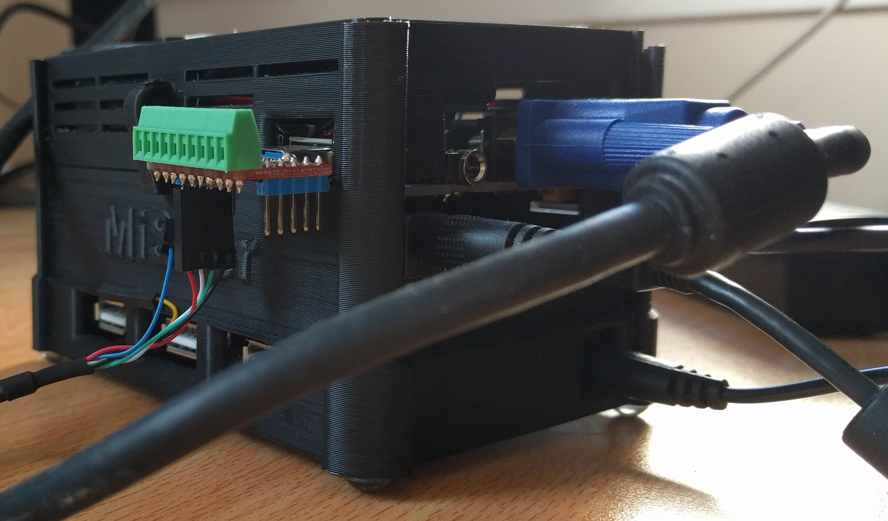

# j1eforth

## DE10NANO and ULX3S Enhancements

* Display
    * VGA for the DE10NANO
    * HDMI for the ULX3S
* PS/2 Keyboard
    * ULX3S has keyboard input (not yet implemented)
    * PS/2 takes priority over the UART
* J1+ CPU
    * 50MHz operation
    * 4 (improved from 5) clock cycles per J1+ CPU operation against 13 clock cycles per operation on the FOMU, giving an effective CPU running at 12.5MHz
    * Changed extra OPCODES to ```0= 0<>- <> 1+ * 2* negate 2/ - 0< 0> > >= abs max min```
    * Arithmetic Co-Processors Added [Mathematics.md](documentation/Mathematics.md)
        * 32 bit Addition/Subtraction Unit ( __SIGNED__ )
            * Total / Difference
            * Increment / Decrement
            * Double / Half
            * Negation
            * Binary
                * Invert
                * Xor
                * Or
                * And
            * Absolute / Maximum / Minimum
            * Comparisons
                * Equal 0
                * Less than 0
                * Equal
                * Less than
        * 32 bit by 16 bit division giving 16 bit quotient and 16 bit remainder ( signed and unsigned )
        * 16 bit by 16 bit division giving 16 bit quotient and 16 bit remainder ( signed )
        * 16 bit by 16 bit multiplication giving 32 bit product ( signed and unsigned )
            * Two implementations provided
                * Binary long multiplication ( not used )
                * via DSP blocks ( used )

Cycle | Action | Notes
----- | ----- | -----
0 | Update stackNext (2nd item on the stack) and rStackTop (1st item on the return stack).<br>Read instruction from PC memory location and stackTop memory location. | Pointers to the correct addresses in the stacks and memory are maintained via wires.
1 | Execute the J1+ CPU instruction. | Memory writes are started in this cycle. Co-processor operations are started in this cycle.
2 | Write to the data and return stacks.<br>ULX3S Clear the co-processor controls. | Update data and return stack pointers and memory addresses. Memory reads are started in this cycle.
3 | DE10NANO Clear the co-processor controls. |

For communication with j1eforth there is a UART which provides input and output, output is duplicated on the terminal display. The ULX3S eventually will have PS/2 keyboard input via the us2 connector and a USB OTG and PS/2 to USB converter.

__DE10NANO__ Open a terminal in the DE10NANO directory and type ```make de10nano```. Wait. Upload your design your DE10NANO with ```quartus_pgm -m jtag -o "p;BUILD_de10nano/build.sof@2"```. Or download from this repository.

__ULX3S__ Open a terminal in the ULX3S directory and type ```make ulx3s```. Wait. Upload your design your ULX3S with ```fujproj BUILD_ulx3s/build.bit```. Or download from this repository.

## J1+ Extra ALU OPCODES

The J1+ CPU adds up to 16 new alu operations, encoded using ALU bit 4 to determine if a J1 or a J1+ ALU operation. The J1+ ALU instruction encoding is:

```
+---------------------------------------------------------------+
| 0 | 1 | 1 |R2P| ALU OPERATION |T2N|T2R|N2A|J1+| RSTACK| DSTACK|
+---------------------------------------------------------------+
| F | E | D | C | B | A | 9 | 8 | 7 | 6 | 5 | 4 | 3 | 2 | 1 | 0 |
+---------------------------------------------------------------+
```

The J1+ new ALU operations are ```0= 0<>- <> 1+ * 2* negate 2/ - 0< 0> > >= abs max min``` _NOTE: These are different from the FOMU version of j1eforth._

Binary ALU Operation Code | J1 CPU | J1+ CPU | J1 CPU Forth Word (notes) | J1+ CPU Forth Word | J1+ Implemented in j1eforth
:----: | :----: | :----: | :----: | :----: | :----:
0000 | T | T==0 | (top of stack) | 0= | X
0001 | N | T<>0 | (next on stack) | 0<> | X
0010 | T+N | N<>T | + | <> | X
0011 | T&N | T+1 | and | 1+ | X
0100 | T&#124;N | N&#042;T | or | &#042;<br>16 bit x 16 bit multiply, returning 16 bit result<br>Accelerated by DSP | X
0101 | T^N | T&#042;2 | xor | 2&#042; | X
0110 | ~T | NEGT | invert | negate | X
0111 | N==T | thlf | = | 2/ | X
1000 | N<T | nsbt | <<br>(signed) | - | X
1001 | N>>T | t<0 | rshift | 0< | X
1010 | T-1 | t>0  | 1- | 0> | X
1011 |  rt | n>t | (push top of return stack to data stack) | > | X
1100 | [T] | n>=t | @ <br> (read from memory) | >= | X
1101 | N<<T | abst | lshift | abs | X
1110 | dsp | mxnt | (depth of stacks) | max | X
1111 | NU<T | mnnt | <<br> (unsigned) | min | X

### Resource Usage (DE10NANO)

__UPDATE 2020-11-07 Move to memory mapped I/O and DSP Multiplication__

```
Family : Cyclone V
Device : 5CSEBA6U23I7
Timing Models : Final
Logic utilization (in ALMs) : 9,947 / 41,910 ( 24 % )
Total registers : 6386
Total pins : 36 / 314 ( 11 % )
Total virtual pins : 0
Total block memory bits : 2,655,776 / 5,662,720 ( 47 % )
Total RAM Blocks : 355 / 553 ( 64 % )
Total DSP Blocks : 21 / 112 ( 19 % )
Total HSSI RX PCSs : 0
Total HSSI PMA RX Deserializers : 0
Total HSSI TX PCSs : 0
Total HSSI PMA TX Serializers : 0
Total PLLs : 1 / 6 ( 17 % )
Total DLLs : 0 / 4 ( 0 % )
```

### Resource Usage (ULX3S)

__UPDATE 2020-11-07 Move to memory mapped I/O and DSP Multiplication__

```
Info: Device utilisation:
Info:          TRELLIS_SLICE: 20715/41820    49%
Info:             TRELLIS_IO:    34/  365     9%
Info:                   DCCA:     3/   56     5%
Info:                 DP16KD:   205/  208    98%
Info:             MULT18X18D:    31/  156    19%
Info:                 ALU54B:     0/   78     0%
Info:                EHXPLLL:     2/    4    50%
Info:                EXTREFB:     0/    2     0%
Info:                   DCUA:     0/    2     0%
Info:              PCSCLKDIV:     0/    2     0%
Info:                IOLOGIC:     0/  224     0%
Info:               SIOLOGIC:     4/  141     2%
Info:                    GSR:     0/    1     0%
Info:                  JTAGG:     0/    1     0%
Info:                   OSCG:     0/    1     0%
Info:                  SEDGA:     0/    1     0%
Info:                    DTR:     0/    1     0%
Info:                USRMCLK:     0/    1     0%
Info:                CLKDIVF:     0/    4     0%
Info:              ECLKSYNCB:     0/   10     0%
Info:                DLLDELD:     0/    8     0%
Info:                 DDRDLL:     0/    4     0%
Info:                DQSBUFM:     0/   14     0%
Info:        TRELLIS_ECLKBUF:     0/    8     0%
Info:           ECLKBRIDGECS:     0/    2     0%
```

## VGA/HDMI Multiplexed Display

The VGA DE10NANO/HDMI ULX3S output has the following layers in order:

* Background [Background.md](documentation/Background.md)
* Tilemap Layer [Tilemap.md](documentation/Tilemap.md)
* Lower Sprite Layer [Sprites.md](documentation/Sprites.md)
* Bitmap with GPU [Bitmap and GPU.md](documentation/Bitmap%20and%20GPU.md)
    * Vector block drawer [Vectors.md](documentation/Vectors.md)
    * Display list drawer [Display List.md](documentation/Display%20List.md)
* Upper Sprite Layer [Sprites.md](documentation/Sprites.md)
* Character Map with TPU [Character Map and TPU.md](documentation/Character%20Map%20and%20TPU.md)
* Terminal [Terminal.md](documentation/Terminal.md)

All of the display layers operate at 25Mhz, the pixel clock for the 640 x 480 display, all synchronised with each other. These display layers then are combined by the multiplex display [Multiplex Display.md](documentation/Multiplex%20Display.md) to form the display.

Due to the address space limitations of the J1+ CPU ( 65536 x 16 bit), the display layer memories cannot be memory mapped. Control of the display layers is done via memory mapped control registers.  _Some_ j1eforth words are provided as helpers.

DE10NANO uses a separate memory map file, memmap_io.ice with a separate J1+ CPU in j1eforth.ice. ULX3S uses a combined J1+ CPU and memory map in j1eforth-nomemmap.ice until an issue can be resolved.

The initial basic bitmap and terminal windows were extended to include as many capabilities as could fit into the design, which at present is limited by the amount of BRAM available on the ULX3S. The aim being to create a functional general computer running j1eforth, focussing on as many features as possible found in the popular home computers of the 1980s.

For note I owned, and programmed (home computers) the following:

* Game consoles:
    * Atari VCS 2600
    * PlayStation 2
    * PlayStation 3
* Home computers
    * Commodore Vic 20
        * 6502 assembly language
    * Commodore 64
        * 6502 assembly language
        * The motivation for providing sprite layers
    * Atari ST original 512 and 512FM
        * 68000 assembly language
    * Commodore Amiga A500 and A1200
        * 68000 / 68030 assembly language and C

All of the non-CPU components are provided as co-processors, so that the J1+ CPU can continue executing Forth code whilst the co-processor continues with the assigned task. The terminal window for example operates as a basic display output alongside the UART, with no further intervention required by the j1eforth environment to output to the terminal, other than to output to the UART.

Simple examples to test some of the features of the display are provided in [Examples.md](documentation/Examples.md)

The sample code provided in [Big Example Part 1.md](documentation/Big%20Example%20Part%201.md) and [Big Example Part 2.md](documentation/Big%20Example%20Part%202.md) is used for driving feature development, features are added if they are required by the simple asteroids type game.

## Additional Features

* ULX3S has basic (polyphonic) stereo sound capabilities [Audio.md](documentation/Audio.md)
    * There are 3 notes playable per left/right channel
        * Polyphonic mixing is not good
* Timers and a pseudo random number generator are provided [Timers.md](documentation/Timers.md)

## TODO

### ALL DISPLAY LAYERS

* Re-implement display layer fader level
    * Implement via multiplex display directly

### AUDIO

* Sound for the DE10NANO
* Volume control

### GPU

* Double Sized Blitter
    * Perform double size blit in 1 bit from 16 x 16 tile to 32 x 32 result
* Colour Blitter
    * 10 bit { Arrggbb } 16 x 16 blitter from a configurable 64 16 x 16 tilemap (16384 * 7 bit, might be too big for the blockram)
        * ALPHA will determine if pixel is placed or missed (mask)

### Character map

* Change characterGenerator8x16 from BROM to BRAM to allow changes to the font
* Implement character generator writer in the same format as the tile map tile, sprite tile, blit1 tile, vector vertex and display list entry writers

### Tile Map

* Stop glitches when scrolling/wrapping

### Display Lists

* Get working on ULX3S

### Mathematics Co-Processors

* 32 by 16 bit division -> 16 bit quotient and remainder ( unsigned um/mod )
* 32 by 16 bit division -> 16 bit quotient and remainder ( signed m/mod )
* 16 * 16 bit multiplication -> 32 bit product ( unsigned um* )
* 16 * 16 bit multiplication -> 32 bit product ( signed m* )
* 16 * 16 bit multiplication -> 16 bit product ( implemented via DSP block )

## Notes

* UART rx for the de10nano is on PIN_AG11 which maps to Arduino_IO15. On the MiSTer I/O board this pin is accessible by the USB3-lookalike USER port.
* UART tx for the de10nano is on PIN_AH9 which maps to Arduino_IO14. On the MiSTer I/O board this pin is accessible by the USB3-lookalike USER port.

I use a USB3 breakout board in the USER port to easily access the above pins. Changing the uart to uart2 in the DE10NANO makefile will change the UART pins to others unused by the MiSTer I/O board on the DE10NANO Arduino port to UART rx on PIN_AG8, UART tx on PIN_AH8.


