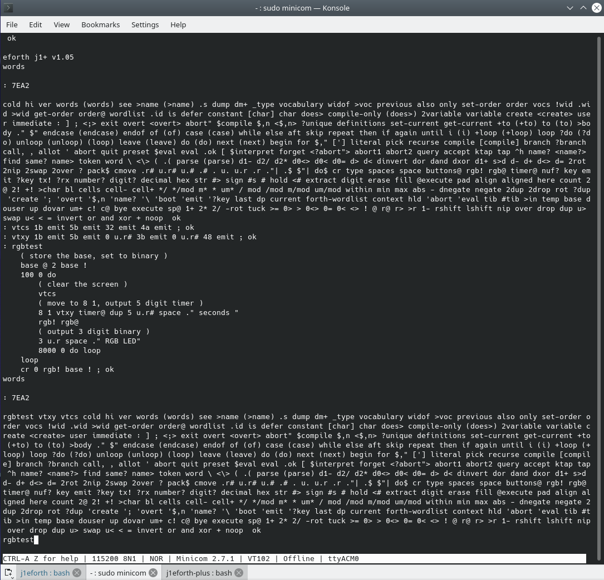

### Sample Code

This can be copied and pasted into the terminal. Try to keep line lengths relatively short when cutting and pasting.

```
: vtcs 1b emit 5b emit 32 emit 4a emit ;
: vtxy 1b emit 5b emit 0 u.r# 3b emit 0 u.r# 48 emit ;
: ledtest
    ( store the base, set to binary )
    base @ 2 base !
    100 0 do 
        ( clear the screen )
        vtcs
        ( move to 8 1, output 5 digit timer )
        8 1 vtxy timer@ dup 5 u.r# space ." seconds "
        led! led@ 
        ( output 3 digit binary )
        8 u.r space ." LEDs" 
        8000 0 do loop 
    loop
    cr 0 led! base ! ;
```

This code defines 3 new Forth words:

* `vtcs` which clears the terminal ( sends ESC [ 2 J )
* `vtxy` moves the cursor to the position defined by the top two locations on the stack, `8 1 vtxy` moves the cursor to line 1 column 8 ( sends ESC [ 1 ; 8 H )
* `ledtest` Loops, clears the screen then displays the number of seconds elapsed whilst changing the RGB LED to the lower 3 bits of the timers, and then displaying the binary (`2 base !` changes to binary) status of the RGB LED. Finally turning off the RGB LED.

Start the test with `ledtest`.


